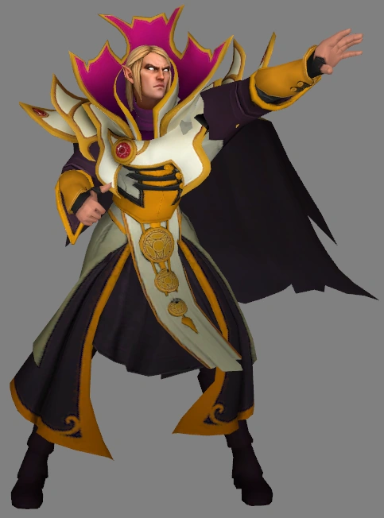

# peonpack-invoker

An [OpenPeon](https://github.com/PeonPing/openpeon) (CESP v1.0) voice pack featuring **Invoker** from Dota 2, for use with [peon-ping](https://github.com/PeonPing/peon-ping).

> *"I am a beacon of knowledge blazing out across a black sea of ignorance."*

<p align="center">
  
</p>

## About Invoker

Carl, the Invoker, is one of the most complex and iconic heroes in Dota 2. An arrogant, ageless magus who has studied magic for millennia, he has memorized so many spells that he has forgotten more than most will ever learn. Where other heroes command a handful of abilities, Invoker wields **ten** — combining three elemental orbs (Quas, Wex, Exort) to invoke devastating spells from Sunstrike to Chaos Meteor to Deafening Blast.

His voice lines drip with condescension, intellectual superiority, and barely contained contempt for lesser minds — making him the perfect companion for your coding sessions.

## Voice Lines

24 sounds across 7 categories:

| Category | Count | Lines |
|----------|-------|-------|
| **session.start** | 5 | "Invoker!" / "Thus I invoke myself!" / "So begins a new age of knowledge." / "Knowledge is power!" / "Glorious invocation!" |
| **task.acknowledge** | 4 | "Mindfully." / "I am committed." / "I proceed." / "Thither I go." |
| **task.complete** | 3 | "Behold!" / "One of my favorites." / "Witness true sorcery!" |
| **task.error** | 3 | "Words fail me..." / "Did I miscast?" / "An end to ages of learning." |
| **input.required** | 3 | "Over yon?" / "Denied!" / "I'm betwixt myself." |
| **resource.limit** | 3 | "Denied!" / "Denied!" / "Demised." |
| **user.spam** | 3 | "'Tis tedious." / "This bores me." / "Lamentable." |

## Installation

### With peon-ping (recommended)

```bash
# Clone into your packs directory
git clone https://github.com/bwarren2/peonpack-invoker ~/.openpeon/packs/dota2_invoker

# Or symlink from wherever you cloned it
ln -s /path/to/peonpack-invoker ~/.openpeon/packs/dota2_invoker
```

Then set Invoker as your active pack in `~/.claude/hooks/peon-ping/config.json`:

```json
{
  "active_pack": "dota2_invoker"
}
```

## Related Projects

- [peon-ping](https://github.com/PeonPing/peon-ping) — The main project. Sound notifications for Claude Code and other agentic IDEs.
- [OpenPeon / CESP v1.0](https://github.com/PeonPing/openpeon) — The open standard for coding event sound packs.
- [og-packs](https://github.com/PeonPing/og-packs) — The original sound packs (Warcraft, StarCraft, Portal, and more).
- [OpenPeon Registry](https://github.com/PeonPing/registry) — Community pack index.

## License

Audio sourced from Dota 2 by Valve Corporation. This pack is provided under [CC-BY-NC-4.0](https://creativecommons.org/licenses/by-nc/4.0/) for personal, non-commercial use.
